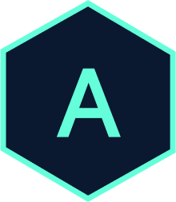

<div align="center">
  
</div>

<h1 align="center">
  aakashpahuja.com
</h1>

<p align="center">
  The second iteration of my personal portfolio website built with <a href="https://www.gatsbyjs.org/" target="_blank">Gatsby</a> and hosted on <a href="https://www.netlify.com/" target="_blank">Netlify</a>.
</p>

<p align="center">
  <a href="https://app.netlify.com/sites/mystifying-heyrovsky-c7b1fb/deploys" target="_blank">
    
  </a>
</p>

<p align="center">
  <a href="https://www.aakashpahuja.com" target="_blank">
    <strong>🚀 View Live Site</strong>
  </a>
</p>

---

## 🛠️ Tech Stack

| Category | Technology |
|----------|------------|
| Framework | [Gatsby](https://www.gatsbyjs.org/) |
| Styling | [Styled Components](https://styled-components.com/) |
| State Management | [Redux](https://redux.js.org/) |
| Content | Markdown |
| Deployment | [Netlify](https://www.netlify.com/) |
| Analytics | Google Analytics |

---

## 📁 Project Structure

```
├── content/              # Markdown content for pages
│   ├── posts/            # Blog posts
│   ├── jobs/             # Work experience
│   ├── projects/         # Project showcases
│   └── ...
├── src/
│   ├── components/       # React components
│   ├── pages/            # Page components
│   ├── styles/           # Global styles and theme
│   ├── templates/        # Page templates (blog, tags)
│   └── utils/            # Utility functions
├── static/               # Static assets
├── gatsby-config.js      # Gatsby configuration
├── gatsby-node.js        # Gatsby Node APIs
└── netlify.toml          # Netlify configuration
```

---

## 🚀 Getting Started

### Prerequisites

- Node.js >= 22.0.0
- npm >= 10.0.0

### Installation

1. **Clone the repository**

   ```bash
   git clone https://github.com/dgr8akki/portfolio.git
   cd portfolio
   ```

2. **Install dependencies**

   ```bash
   npm install
   ```

3. **Start the development server**

   ```bash
   npm start
   ```

   The site will be running at `http://localhost:8000`

---

## 📝 Available Scripts

| Command | Description |
|---------|-------------|
| `npm start` | Start development server |
| `npm run build` | Build for production |
| `npm run serve` | Serve production build locally |
| `npm run clean` | Clear Gatsby cache |
| `npm run format` | Format code with Prettier |

---

## ✍️ Adding Content

### Blog Posts

Create a new folder in `content/posts/` with an `index.md` file:

```markdown
---
title: Your Post Title
description: A brief description
date: 'YYYY-MM-DD'
draft: false
slug: '/pensieve/your-post-slug'
tags:
  - Tag1
  - Tag2
---

Your content here...
```

### Work Experience

Add a new folder in `content/jobs/` with company details in `index.md`.

### Projects

Add project details in `content/projects/` or `content/featured/`.

---

## 🎨 Customization

### Colors & Theme

Edit `src/styles/theme.js` to customize colors, fonts, and other theme variables.

### Site Metadata

Update `src/config/index.js` for site title, description, social links, and navigation.

---

## 📦 Deployment

The site automatically deploys to Netlify on every push to the `master` branch.

To deploy manually:

```bash
npm run build
```

The production build will be in the `public/` directory.

---

## 📄 License

This project is licensed under the MIT License. See the [LICENSE](LICENSE) file for details.

---

<div align="center">
  <sub>Built with ❤️ by <a href="https://www.aakashpahuja.com">Aakash Pahuja</a></sub>
</div>
