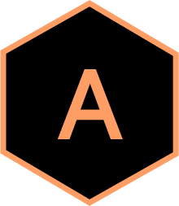

<div align="center">
  
</div>

<h1 align="center">
  aakashpahuja.com
</h1>

<p align="center">
  My personal portfolio website built with <a href="https://nextjs.org/" target="_blank">Next.js</a> and <a href="https://tailwindcss.com/" target="_blank">Tailwind CSS</a>.
</p>

<p align="center">
  <a href="https://www.aakashpahuja.com" target="_blank">
    <strong>🚀 View Live Site</strong>
  </a>
</p>

---

## 🛠️ Tech Stack

| Category | Technology |
|----------|------------|
| Framework | [Next.js 15](https://nextjs.org/) (App Router) |
| Styling | [Tailwind CSS](https://tailwindcss.com/) |
| Animations | [Framer Motion](https://www.framer.com/motion/) |
| Icons | [Font Awesome](https://fontawesome.com/) |
| Content | Markdown + gray-matter |
| Language | TypeScript |
| Deployment | [Vercel](https://vercel.com/) |

---

## ✨ Features

- **Responsive Design** - Looks great on all devices
- **Dark Theme** - Easy on the eyes
- **Animated Loading Screen** - Cool logo animation on first visit
- **Blog System** - Markdown-based blog with tags
- **SEO Optimized** - Dynamic sitemap, meta tags, Open Graph
- **Fast Performance** - Static generation, optimized images

---

## 📁 Project Structure

```
├── app/                  # Next.js App Router pages
│   ├── blog/             # Blog pages
│   ├── globals.css       # Global styles
│   ├── layout.tsx        # Root layout
│   └── page.tsx          # Homepage
├── components/           # React components
│   ├── layout/           # Layout components (Navbar, Footer, etc.)
│   ├── sections/         # Homepage sections (Hero, About, Skills, etc.)
│   ├── ui/               # UI components (Icons, Loader, Logo)
│   └── blog/             # Blog components
├── content/              # Markdown content
│   ├── about/            # About section content
│   ├── contact/          # Contact section content
│   ├── featured/         # Featured projects
│   ├── hero/             # Hero section content
│   ├── jobs/             # Work experience
│   ├── posts/            # Blog posts
│   ├── projects/         # Other projects
│   └── skills/           # Skills section content
├── lib/                  # Utilities
│   ├── config.ts         # Site configuration
│   ├── content.ts        # Content fetching
│   └── utils.ts          # Helper functions
├── public/               # Static assets
│   ├── fonts/            # Custom fonts (Calibre, SF Mono)
│   └── images/           # Images
└── tailwind.config.ts    # Tailwind configuration
```

---

## 🚀 Getting Started

### Prerequisites

- Node.js >= 20.0.0
- npm

### Installation

```bash
# Clone the repository
git clone https://github.com/dgr8akki/aakashpahujadotcom.git
cd aakashpahujadotcom

# Install dependencies
npm install

# Start development server
npm run dev
```

The site will be running at `http://localhost:3000`

---

## 📝 Available Scripts

| Command | Description |
|---------|-------------|
| `npm run dev` | Start development server |
| `npm run build` | Build for production |
| `npm run start` | Start production server |
| `npm run lint` | Run ESLint |
| `npm run format` | Format code with Prettier |

---

## ✍️ Adding Content

### Blog Posts

Create a new folder in `content/posts/` with an `index.md` file:

```markdown
---
title: Your Post Title
description: A brief description
date: '2026-01-12'
draft: false
tags:
  - Tag1
  - Tag2
---

Your content here...
```

### Work Experience

Create a new folder in `content/jobs/` with an `index.md` file:

```markdown
---
company: Company Name
title: Your Job Title
location: City, Country
range: Jan 2024 - Present
url: https://company.com
order: 1
---

- Achievement or responsibility
- Another point
```

### Featured Projects

Create a new folder in `content/featured/` with an `index.md` file and an optional cover image:

```markdown
---
title: Project Name
cover: './cover.png'
github: https://github.com/username/repo
external: https://project-url.com
tech:
  - React
  - Node.js
order: 1
---

Project description here.
```

---

## 🎨 Customization

### Colors & Theme

Edit `tailwind.config.ts` to customize colors, fonts, and other design tokens.

### Site Configuration

Update `lib/config.ts` for:
- Site title and description
- Social links
- Navigation items
- Contact information

---

## 📦 Deployment

The site is configured for automatic deployment to Vercel. Simply push to the main branch and Vercel will build and deploy automatically.

For manual deployment:

```bash
npm run build
npm run start
```

---

## 📄 License

MIT License - see [LICENSE](LICENSE) for details.

---

<div align="center">
  <sub>Built with ❤️ by <a href="https://www.aakashpahuja.com">Aakash Pahuja</a></sub>
</div>
